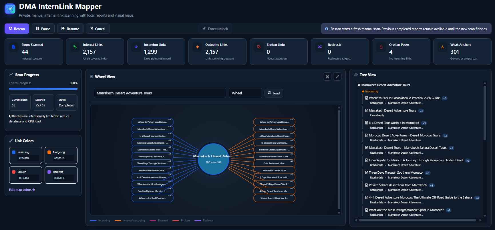
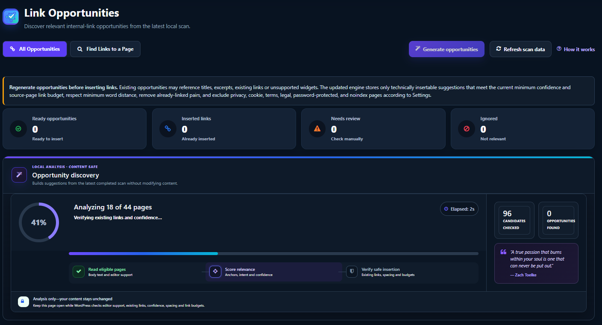

# DMA InternLink Mapper

[](https://github.com/teamdma/dma-internlink-mapper/actions/workflows/quality.yml)

**DMA InternLink Mapper** is a WordPress internal linking and technical SEO plugin for analyzing site structure, finding orphan pages, discovering internal link opportunities, reviewing anchor text, and checking broken or external links.

It helps WordPress site owners understand how pages connect through visual 2D/3D link maps and a Knowledge Graph, while keeping the core analysis inside WordPress.


## Screenshots

### Internal Link Dashboard



Analyze internal links, incoming and outgoing links, orphan pages, weak anchors, redirects and broken links from one WordPress dashboard.

### Knowledge Graph


Explore internal-link relationships in a visual 2D knowledge graph, inspect page authority and architecture health, and export graph reports.

### Link Opportunities



Find relevant internal-link opportunities using local analysis with confidence checks, existing-link validation and content-safe insertion rules.


## WordPress internal linking and SEO features

- Internal link scanner and link reports
- Internal link opportunities with preview, validation and undo
- Orphan page detection
- Anchor text analysis
- Broken link checking and repair tools
- External link analysis
- Visual 2D/3D internal link maps
- Knowledge Graph for site structure
- On-page SEO checks
- Search Console CSV/ZIP import
- Classic Editor, Gutenberg and Elementor support

External destination checking is optional.

## What DMA InternLink Mapper helps you find

The plugin is designed for common WordPress SEO and site-architecture tasks, including:

- pages with too few or no internal links
- useful internal linking opportunities between related content
- broken internal and external links
- repeated or weak anchor text patterns
- important pages that are difficult to reach through the current link structure
- large-site relationships that are easier to understand visually than in a spreadsheet

## Requirements

- WordPress 6.5+
- PHP 7.4+

## Documentation

Full documentation and usage guidance:

https://desertmoroccoadventure.com/files/internal-link-seo-mapper/

## Development and security checks

This repository contains the plugin source, release history, tests and automated quality checks.

Useful commands after `composer install`:

```bash
composer lint:php
composer audit:security
composer test
composer phpcs:security
composer phpcs:compat
```

The WordPress.org plugin information lives in `readme.txt`.

## License

GPL-2.0-or-later
